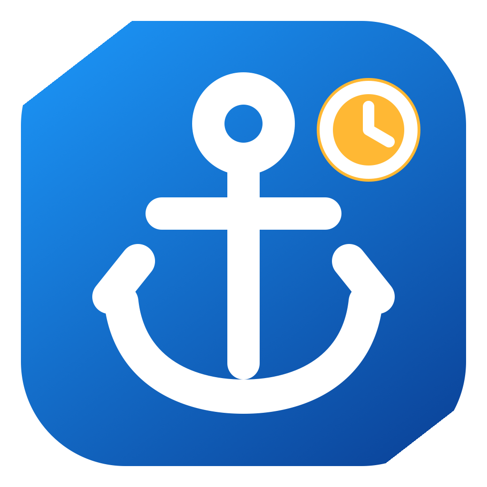

# CronHarbor

<p align="center">
  
</p>

<p align="center">
  A native macOS menu bar app for seeing, editing, pausing, and safely running your user cron jobs.
</p>

CronHarbor gives classic `cron` a clear Mac interface without replacing it or hiding what is installed. The complete workflow lives in a compact menu bar panel: browse jobs, inspect schedules, edit, review staged changes, and check **Run Now** history without opening a dashboard. It reads the signed-in user's crontab through `/usr/bin/crontab` and preserves source it cannot safely understand.

## Highlights

- True menu-bar-first SwiftUI app with no main window or Dock icon
- Compact inline job list, detail, editor, staged-change review, and run history
- Search and filters for active, paused, and attention-needed jobs
- Friendly presets with exact five-field expressions and supported `@shortcuts`
- Rich human-readable schedule descriptions with a verbatim fallback for anything ambiguous
- Live next-occurrences preview while editing an expression, and the next three runs in job detail
- Field-specific validation messages that name the failing cron field and reason
- Reversible pause and resume, including macOS's `@AppleNotOnBattery` qualifier
- Explicit staging, review, and apply flow, plus one-click job duplication
- Conflict detection, private backups, and exact post-install readback
- A Settings backups browser to reveal, restore, or prune those backups safely
- Confirmed **Run Now** with cron-like shell, environment, and `%` preprocessing
- Run history with a failures-only filter and a confirmed clear action
- Optional launch at login; no analytics, telemetry, account, or network service

## Requirements

- macOS 14 Sonoma or later
- Swift 6 toolchain for source builds (Xcode 16 or later is recommended)

CronHarbor manages only the current user's crontab. It does not use `sudo`, edit cron spool files directly, or manage another user.

## Install

### Homebrew

The Homebrew distribution is a source formula: Homebrew compiles CronHarbor on your Mac and stages the resulting app locally.

```sh
brew install lu-zhengda/tap/cronharbor
cronharbor
```

### Source checkout

From the repository root:

```sh
swift test
./script/build_and_run.sh
```

The script builds `dist/CronHarbor.app`, signs it ad hoc for local development, and launches it. The app has no Dock icon or main window by design; use its menu bar anchor. Settings opens a separate window only when requested.

To produce a universal release candidate:

```sh
./script/package_release.sh
```

That script tests the package, builds arm64 and x86_64, validates a clean extraction, and creates `dist/CronHarbor-<version>.zip`. Without `CODESIGN_IDENTITY`, the archive is ad-hoc signed. Setting that variable signs with the supplied identity and hardened runtime; notarization and stapling additionally require `NOTARYTOOL_PROFILE`. The default archive is **not** a notarized, Gatekeeper-trusted public binary. See [Release trust](#release-trust).

## How edits stay safe

CronHarbor treats the crontab as a byte-preserving document, not a file it is free to reformat.

1. It reads the current user's crontab with `/usr/bin/crontab -l`. Output above 16 MiB is rejected before parsing or writing; a truncated prefix is never treated as a complete document.
2. Blank lines, comments, environment assignments, line endings, and unrecognized source remain authoritative raw bytes.
3. Edits stay in the app until **Review & Apply** is confirmed.
4. Immediately before a write, CronHarbor re-reads the crontab and compares its SHA-256 digest with the version you reviewed. A mismatch stops the write.
5. It saves the exact current bytes to a private backup, performs a second digest check after that I/O, installs through `/usr/bin/crontab`, and reads back the result byte-for-byte.

Created or edited jobs receive transparent `# CronHarbor:job:...` metadata comments. Paused jobs use a reversible comment representation that retains the exact original job bytes. Untouched jobs and protected lines are not normalized. Explicitly editing an imported job lets CronHarbor take ownership of that target block; explicitly deleting one removes that target. Duplicate managed identities are treated as protected source instead of being guessed at.

Backups are stored under:

```text
~/Library/Application Support/CronHarbor/Backups/
```

The directory is created with mode `0700` and each backup with mode `0600`. Settings → Backups lists every backup with its date and size, reveals the folder in Finder, restores a chosen backup, or deletes old backups while keeping the newest 20; backups are never pruned automatically. Restoring goes through the same safety pipeline as an apply: the current crontab is re-read, backed up, digest-checked immediately before the write, and read back byte-for-byte afterward.

Read the full [safety model](docs/SAFETY.md) before using CronHarbor with important jobs.

## Run Now

**Run Now is not a cron event.** Every entry point asks for confirmation, then intentionally ignores the job's schedule, paused state, and any AC-power-only restriction. A job with staged changes cannot be run until those changes are applied or discarded.

Before execution, CronHarbor re-reads the installed crontab and requires its complete SHA-256 revision—and the selected job's name, schedule, command, enabled state, metadata ownership, and AC restriction—to match what was confirmed. It then builds an immutable invocation from that installed snapshot. This whole-source check also catches changes to preceding environment assignments. CronHarbor defaults to `/bin/sh` and a minimal `PATH` when those values are absent, runs in the account's `HOME`, and implements cron's special unescaped `%` behavior. It does not inherit the app's full environment or copy arbitrary app secrets into the child process.

Run history contains only executions started by CronHarbor—not executions started by the cron daemon. The newest 100 records, including captured standard output and standard error, are stored locally at:

```text
~/Library/Application Support/CronHarbor/run-history.json
```

That file is set to mode `0600`. CronHarbor retains at most 1 MiB from each output stream per run, marks truncation, and keeps draining the child so noisy output cannot deadlock it. It does not redact command output, so treat history as potentially sensitive.

## Supported source

CronHarbor understands standard five-field schedules with numeric lists, ranges, and steps, plus standalone case-insensitive month and weekday names. It also supports:

```text
@reboot  @yearly  @annually  @monthly
@weekly  @daily   @midnight  @hourly
```

It also recognizes macOS's command prefix after a supported schedule, for example `0 2 * * * @AppleNotOnBattery /path/to/command`. A line with unsupported, malformed, non-UTF-8, or otherwise ambiguous syntax is reported as protected and kept exactly as read rather than guessed at.

Next-run times are local estimates. The system cron daemon remains the authority, and macOS cron does not catch up runs missed while the Mac is asleep.

## Privacy

CronHarbor has no analytics or telemetry and contains no network client. Your crontab, backups, and Run Now history stay on the Mac. Commands you choose to execute can, of course, access the network and filesystem with your user permissions.

See [SECURITY.md](SECURITY.md) for reporting vulnerabilities and [docs/SAFETY.md](docs/SAFETY.md) for the detailed trust boundary.

## Development

```sh
swift build
swift test
```

The package contains a reusable `CronHarborCore` library, the SwiftUI app, and tests built with Swift Testing. Tests use fake process and crontab clients; they must never install the developer's real crontab.

Contributions are welcome—start with [CONTRIBUTING.md](CONTRIBUTING.md).

## Release trust

The release script produces an ad-hoc-signed artifact by default. `CODESIGN_IDENTITY` enables signing with the supplied identity and hardened runtime. Apple notarization and stapling additionally require `NOTARYTOOL_PROFILE`. A successful local `codesign --verify` check is not equivalent to Developer ID trust or notarization.

Do not work around Gatekeeper for an archive whose provenance you cannot verify. The source-built Homebrew route is the preferred distribution route until a properly signed and notarized binary is published.

## License

CronHarbor is available under the [MIT License](LICENSE).
